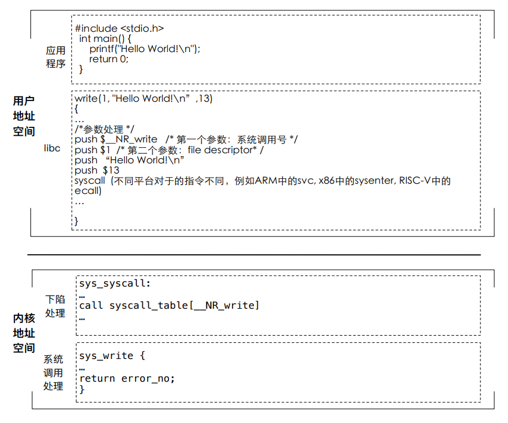

## 操作系统的定义

!!! Reference
    "操作系统是管理硬件资源、控制程序运行、改善人机界面和为应用软件提供支持的一种系统软件。"  ———计算机百科全书(第2版)

操作系统是在硬件和应用之间的软件层


+ 操作系统的核心功能：
    + 将有限的、离散的资源，高效地抽象为无限的、连续的资源
+ 从软件角度的定义：
    + 硬件资源虚拟化+管理功能可编程
+ 从结构角度的定义：
    + 操作系统内核+系统框架


### 操作系统 = 管理 + 服务

**操作系统为应用提供的一些服务**

+ 为应用提供计算资源的抽象 
    + CPU：进程/线程，数量不受物理CPU的限制
    + 内存：虚拟内存，大小不受物理内存的限制
    + I/O设备：将各种设备统一抽象为文件，提供统一接口
+ 为应用提供线程间的同步
    + 应用可以实现自己的同步原语（如spinlock）
    + 操作系统提供了更高效的同步原语（与线程切换配合, 如pthread_mutex）
+ 为应用提供进程间的通信
    + 应用可以利用网络进行进程间通信（如loopback设备）
    + 操作系统提供了更高效的本地通信机制（具有更丰富的语义，如pipe）

**操作系统对应用的管理**

+ 生命周期的管理
    + 应用的加载、迁移、销毁等操作
+ 计算资源的分配
    + CPU：线程的调度机制
    + 内存：物理内存的分配
    + I/O设备：设备的复用与分配
+ 安全与隔离
    + 应用程序内部：访问控制机制
    + 应用程序之间：隔离机制，包括错误隔离和性能隔离

管理和服务的目标有可能存在冲突

+ 服务的目标：单个应用的运行效率最大化
+ 管理的目标：系统的资源整体利用率最大化
+ 例：单纯强调公平性的调度策略往往资源利用率低（如细粒度的round-robin导致大量的上下文切换）

!!! Question
    Q1：如果一台机器有且只有一个应用程序，开机后自动运行且不会退出，是否还需要操作系统？
    ??? success "Answer"
        如果没有操作系统，那么应用就需要直接和硬件打交道，直接实现对硬件资源的管理与抽象的功能，如果应用出现故障，就可能引起计算机直接崩溃而没有诊断和调试的机会。当然，实现一套硬件资源管理与抽象的库确实可以解决刚才提到的资源抽象、故障恢复与调试等问题，但是这个库实现的其实就是操作系统功能的一部分。事实上，当前的一些对性能和时延要求极高的场景就是通过类似的方法实现的，例如基于外核(Exokernel)架构的库操作系统(LibOS)与虚拟化容器等方法

    Q2：如果一个应用希望自己完全控制硬件而不是使用操作系统提供的抽象，是否还需要操作系统？
    ??? success "Answer"
        尽管应用希望直接控制硬件但是应用的加载与销毁、多个应用之间的切换与隔离等管理工作依然需要操作系统来完成。此外,操作系统也可以从全局的角度更合理地对应用进行调度，从而更加高效地利用硬件资源。


## 应用与操作系统的交互：系统调用

**什么是系统调用？**

- 应用调用操作系统的机制，实现应用不能实现的功能

    例如：`printf() -> write() -> sys_write()`

- 使应用调用操作系统的功能就像普通函数调用一样

### 系统调用过程




## 操作系统的功能：管理

避免一个流氓应用独占所有资源

```c
int main() {
  while(1);
}
```
OS会卡死吗？ 不会，原因是操作系统会：

+ 方法-1：每10ms发生一个时钟中断（时间片）
    + 调度器决定下一个要运行的任务
+ 方法-2：可通过信号等打断当前任务执行
    + 如：kill -9 1951
  
如何卡死一个OS？
```c
int main() {
  while(1){
    fork();
  }
}
```
如何解决这个问题？

+ 资源配额：cgroup/Linux
+ 虚拟化：虚拟机
+ 万能方法：重启机器
+ 制度约束：AppStore的程序预审准入机制

